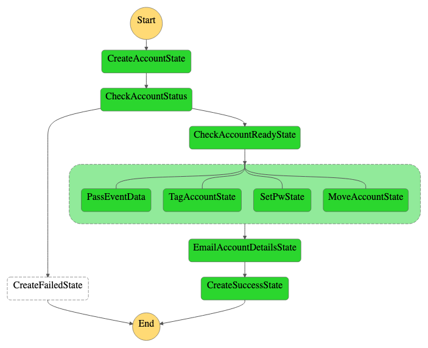
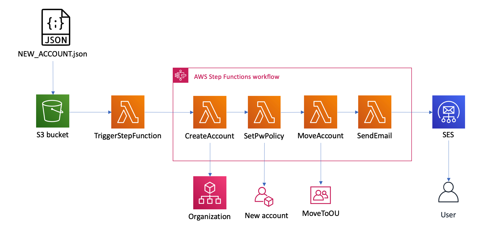

# AWS Account Vending Machine

This serverless app creates AWS accounts in the an AWS Organization using JSON files put in an S3 bucket as source. When JSON files are copied to the S3 bucket, the account is automatically created and the specified stakeholders notified by e-mail of the progress.

Most actions are also broadcast to a Teams channel as the steps are completed.

## Usage

Describes the current deployment in a Master Organization ("master") account. The Stepfunction is `arn:aws:states:{region}:{accountId}:stateMachine:accountVendingMachine`.

The usage described below assumes that the operator has...
* write permissions to the S3 bucket specified in the template (something like `arn:aws:s3:::vending-machine-json-input`)
* configured the access to the master account with CLI (`aws configure --profile [profilename]`)
* know how to use AWS CLI

### 1. Create JSON file with account information
Copy the template and fill out information as needed for the new account being created. You can automatically move the account to the correct Organizations OU for the team in question by specifying *EITHER* "IT Organization" *OR* "Service Platform". RoleName should always default to what is specified in the `env.yml` file, default is `OrganizationsAccount`. Email **MUST** be a valid e-mail address, it's exceedingly difficult to terminate accounts if root is not possible to access. A useful pattern supported by e.g. Gmail, GSuite and Exchange (if configured) is  `aws+[servicename-environment]@domain.com`.

```json
{
    "AccountName": "Account Creation Test",
    "Email": "aws+test1@domain.com",
    "RoleName": "OrganizationsAccount",
    "Tags" : [
        {
            "Key": "Owner",
            "Value": "owner@domain.com"
        },
        {
            "Key": "CostCenter",
            "Value": "1234"
        },
        {
            "Key": "Organization",
            "Value": "IT Organization"
        }
    ]
}
```
Save the file to a temporary place on your hard drive.

### 2. Copy to S3 bucket
Use the AWS CLI command `aws s3 cp` to copy the file, replacing "`NEW_ACCOUNT.json`" with the file you just created, to the S3 bucket. Example:
```bash
aws --profile [profile-name] s3 cp NEW_ACCOUNT.json s3://vending-machine-json-input --region eu-west-1
```

### 3. (Optional) watch progress in Stepfunctions
If you are logged in to the master account via console, you can view the progress of the account creation.

https://eu-west-1.console.aws.amazon.com/states/home?region=eu-west-1#/statemachines/




## Architecture



## Requirements
Requirements are only for deploying the service.

* IAM administrator privileges in the master account
* [Serverless Framework](https://www.serverless.com/)
* Serverless plugins which must be installed:
  * `serverless-python-requirements`
  * `serverless-pseudo-parameters`
  * `serverless-step-functions`

## Deployment

1. Copy paste `env.yml.example` to `env.yml`, change the environment variables as necessary.
2. From the root directory of the project (where `serverless.yml` file is located), substituting `masterAccountProfile` with the propper AWS CLI profile name, run the command
    ```bash
    serverless deploy --aws-profile masterAccountProfile
    ```

## Testing

In the `createAccount` directory there are two functions:
* `step_create_account.py`
* `step_mock_create_account.py`

You can mock account creation to test the different steps of the Stepfunctions service by using the `step_mock_create_account.main` handler instead. Note you will need to provide an additional field `"AccountId": "[ACCOUNT_NUMBER]"` in the input JSON. Example input for mock testing:

```json
{
    "AccountName": "Account Creation Test",
    "Email": "aws+test1@domain.com",
    "RoleName": "OrganizationsAccount",
    "Tags" : [
        {
            "Key": "Owner",
            "Value": "owner@domain.com"
        },
        {
            "Key": "CostCenter",
            "Value": "1234"
        },
        {
            "Key": "Organization",
            "Value": "IT Organization"
        }
    ],
    "AccountId": "123456789012"
}
```

There are additional test input events in the directory `testEvents`. Please note these **MUST** be configured to fit your specific environment (e.g. with valid SES domain), they will not run properly as-is.

## TODO
* Use [moto](https://github.com/spulec/moto) instead of hap-hazard mock function
* Redo architecture picture to reflect actual functions and steps